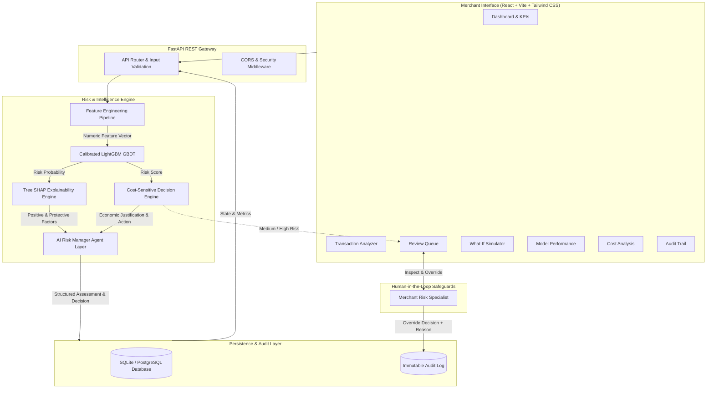

# RazorShield System Architecture

## Overview
RazorShield is an enterprise-grade, cost-sensitive AI risk management platform designed to protect e-commerce merchants from Return-to-Origin (RTO) and return abuse losses while maintaining zero customer friction for trusted buyers.

---

## Architectural Flow Diagram

---

## Component Breakdown

### 1. Presentation Layer (`frontend/`)
- **Single Page Application**: Built with React 18, Vite, and Tailwind CSS.
- **Data Density**: Displays high-density telemetry, KPI summary cards, risk distributions, and probability histograms.
- **Demonstration Suite**: Pre-configured with 5 presentation scenarios accessible via a 1-click header switcher.

### 2. Application & API Gateway (`backend/app/api/`)
- **FastAPI Framework**: High-performance asynchronous REST API with automatic Pydantic v2 input validation and OpenAPI documentation.
- **Endpoints**:
  - `POST /api/analyze`: Synchronous, end-to-end risk evaluation.
  - `POST /api/simulate`: Ephemeral sensitivity simulation.
  - `GET /api/transactions`: Filterable transaction explorer.
  - `GET /api/dashboard`: Aggregated merchant telemetry.
  - `GET /api/model/metrics`: Live held-out evaluation benchmarks.
  - `GET /api/reviews` & `POST /api/reviews/{id}/decision`: Review queue and human override actions.
  - `GET /api/audit`: Chronological audit trail.

### 3. Machine Learning & Explainability (`ml/`)
- **LightGBM Classifier**: Gradient boosted decision tree with sigmoidal probability calibration (`CalibratedClassifierCV`) trained on 70% split and validated on 15% split.
- **Tree SHAP Explainability**: Native `predict(pred_contrib=True)` extraction decomposing exact individual feature contributions into positive risk-increasing flags and negative protective buffers.

### 4. Cost-Sensitive Decision Engine (`backend/app/services/decision_engine.py`)
- **Economic Objective**: Optimizes net merchant margin by comparing:
  $$\text{Expected Avoided Loss} = P(\text{Risk}) \times \text{Potential Loss}$$
  against verification expenses and legitimate customer delay friction.
- **Decision Hierarchy**:
  - `LOW` Risk $\rightarrow$ `APPROVE` (Zero friction)
  - `MEDIUM` Risk $\rightarrow$ `ADDITIONAL_VERIFICATION` (WhatsApp OTP / IVR)
  - `HIGH` Risk $\rightarrow$ `MANUAL_REVIEW` (Flagged for specialist inspection)

### 5. AI Risk Manager Agent (`backend/app/services/agent_service.py`)
- **Supervisory Intelligence**: Translates complex mathematical probabilities and feature contributions into human-readable, grounded justifications.
- **Zero Hallucination Constraint**: Agent only synthesizes verified transaction facts provided by the feature engineering and ML layers.

### 6. Persistence & Audit Trail (`backend/app/models/orm_models.py`)
- **Relational Schema**: Manages transactions, predictions, review queue items, and audit logs.
- **Accountability**: Every AI recommendation and human operator override is immutably logged with timestamp, operator identity, and justification.
